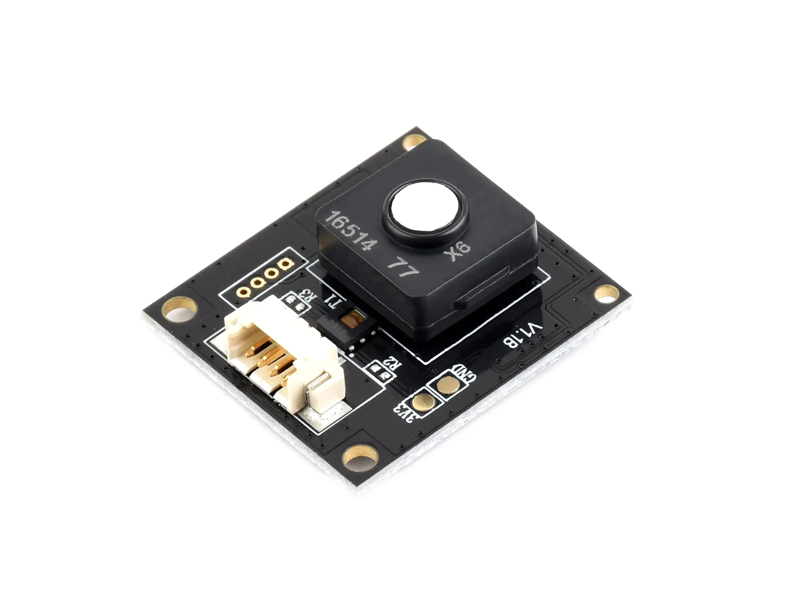

# iNose X6 环境传感器工程库

[English](README.md)

iNose X6 是一款高精度环境传感器，可检测 甲醛 (HCHO)、总挥发性有机物 (TVOC)、一氧化碳 (CO)、空气质量指数 (IAQ)、温度和湿度。
传感器支持 UART 通信，LED 控制，休眠/唤醒功能，并兼容多平台，包括 Arduino、ESP32、RP2040/RP2350 以及 树莓派。

- [购买链接](https://www.waveshare.net/shop/Environment-X6-Sensor.htm)
- [产品文档](https://www.waveshare.net/wiki/Environment_X6_Sensor)

🔧 配置

库支持 UART 端口与波特率的配置。
默认设置：
1. 波特率: 9600
2. 树莓派 5 / CM5: /dev/ttyAMA0
3. 其他树莓派: /dev/ttyS0
4. Arduino / ESP32 / RP2040: 硬件 UART

支持功能：
- 气体浓度检测：HCHO、TVOC、CO、IAQ
- 温度与湿度
- 传感器参数读取（类型、量程、单位）
- LED 控制
- 休眠 / 唤醒
- 序列号与固件版本读取

平台支持表：
| 平台 / MCU | 编程语言 | 支持功能 |
|------------|----------|----------|
| ESP32 / RP2040 | Arduino (C++) | 全功能支持 |
| ESP32 | ESP-IDF (C) | 全功能支持 |
| ESP32 / Pico / Pico2 | MicroPython | 全功能支持 |
| 树莓派（所有型号） | Python | 全功能支持 |
| 树莓派（所有型号） | C | 全功能支持 |

🛠️ 贡献指南

欢迎贡献！你可以这样参与：
1. Fork 本仓库。
2. 创建新分支开发功能或修复问题。
3. 提交清晰的修改描述。
4. 创建 Pull Request 进行代码审查。

🧩 问题与支持

如果遇到任何问题：
1. 查看 Issues 区域。
2. 创建 Issue 并提供详细信息。
3. 查阅文档获取故障排查方法。
4. 联系 Waveshare 团队并提供订单号获取技术支持。

